# Payment Gateway UI

A production-minded **Next.js** payment checkout experience with client-side validation, mock gateway integration, **idempotent retries**, **AbortController-based timeouts**, and **transaction history** persisted in the browser.

---

## Project overview

This application lets a customer enter card details, submit a payment to a **mock API** (`POST /api/pay`), and see clear outcomes (success, failure, or timeout). It demonstrates:

| Topic | Behavior |
|--------|-----------|
| **Payment lifecycle** | Redux-driven statuses from idle → processing → terminal outcomes; overlays prevent double submission while a request is in flight. |
| **Retries** | Up to **3** submission attempts per transaction **reuse the same `transactionId`**; attempt counter and retry affordances are surfaced in the UI. |
| **Timeouts** | Client-side **~6s** abort via `AbortController`; timeouts are distinguished from generic network failures in messaging. |
| **Idempotency** | One UUID per payment session; history rows **upsert** by id so retries do not duplicate entries. |
| **Persistence** | Snapshot (`transactions` + `selectedTransactionId`) stored under a **versioned** `localStorage` key; parsed safely with graceful fallback if data is corrupt. |

---

## Tech stack

| Layer | Choice |
|--------|--------|
| Framework | **Next.js** (App Router) |
| Language | **TypeScript** (`strict: true`) |
| State | **Redux Toolkit** + **React Redux** |
| Styling | **Tailwind CSS** v4 |
| Validation | Custom validators + **Zod** on the API route |

---

## Features

- Real-time **form validation** (amount, PAN, expiry, CVV, currency)
- **Card formatting** and caret-stable edits for PAN and expiry
- **Card type detection** (Visa, Mastercard, Amex) with inline hints and preview
- **Live card preview** reflecting typed cardholder name, digits, and expiry
- Explicit **payment lifecycle** UI (processing overlay, terminal status screens)
- **Retry** flow with shared transaction reference and exhaustion messaging
- **`AbortController`** frontend timeout aligned with user-facing copy
- **Transaction history** list with detail modal, pagination (“Show more”), and persistence
- **Responsive** layout (mobile-first, tuned for ~375px, tablet, and desktop widths)
- **Accessibility**: semantic regions, labels / `aria-describedby`, focus management after outcomes and in dialogs, keyboard-operable controls

---

## Visual showcase

> **Portfolio note:** Real captures from the running app (dark theme). They map to the behaviours above—**brand inference**, **cross-field validation**, **live preview sync**, **terminal Redux states** (success, **gateway failure**, **client timeout**), **Sonner toasts**, **`localStorage` history**, **retry budgeting**, and an accessible **`<dialog>` receipt**—plus **narrow-viewport** layouts.

<p align="center">
  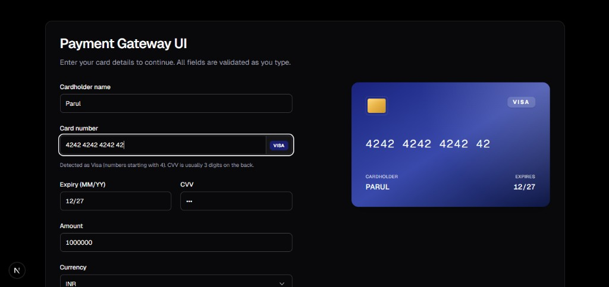
</p>

<p align="center"><strong>1 · Ready-to-pay desktop shell</strong> — Visa detection inside the PAN input group, INR/large-amount entry, CVV masking, and the preview mirroring digits + expiry + cardholder in lockstep.</p>

<br />

<p align="center">
  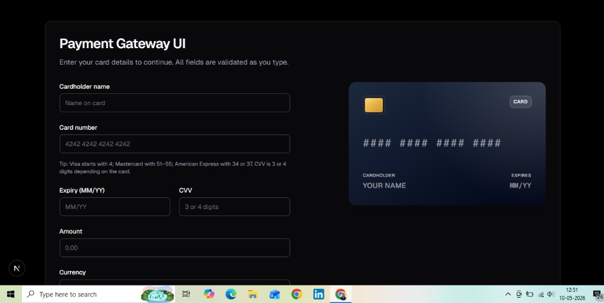
</p>

<p align="center"><strong>2 · Guided empty state</strong> — Instructional subcopy explains **how networks are inferred** (Visa / Mastercard / Amex prefixes) before the user commits digits—reduces support-style friction in demos.</p>

<details>
<summary><strong>Expand — multi-brand validation, submission readiness, success & receipts</strong></summary>

<br />

<p align="center">
  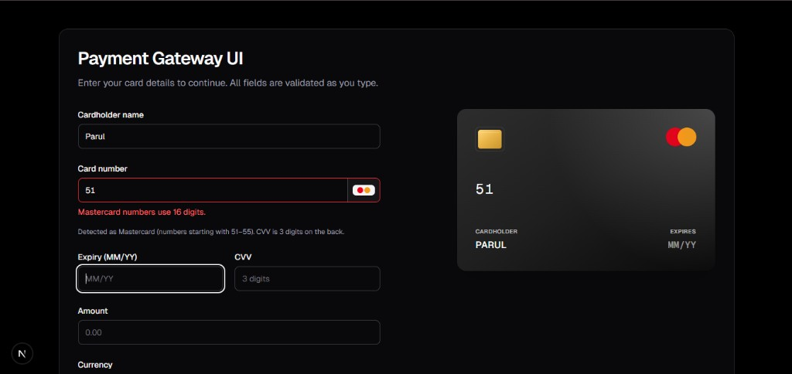
</p>

<p align="center"><strong>3 · Mastercard guardrails</strong> — Inline chip + rule-driven messaging (**16-digit PAN**) while the preview adopts Mastercard artwork—shows deterministic validation, not generic errors.</p>

<br />

<p align="center">
  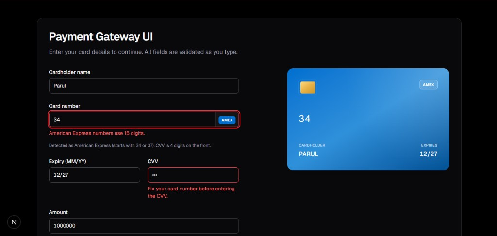
</p>

<p align="center"><strong>4 · Amex + dependent fields</strong> — **15-digit** expectation and **CVV gated on PAN health** (“fix card number before CVV”) demonstrate dependency-aware form UX.</p>

<br />

<p align="center">
  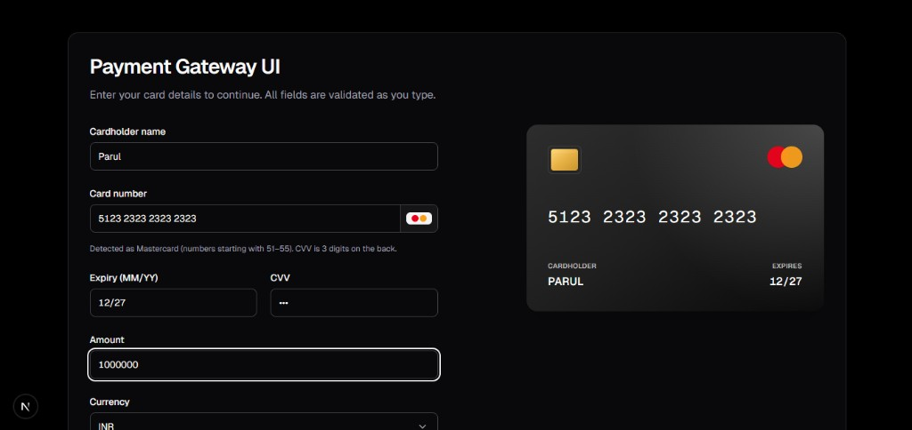
</p>

<p align="center"><strong>5 · Complete PAN parity</strong> — Fully spaced Mastercard PAN, detected badge, and preview fidelity—proof of stable caret/formatting logic ahead of submit.</p>

<br />

<p align="center">
  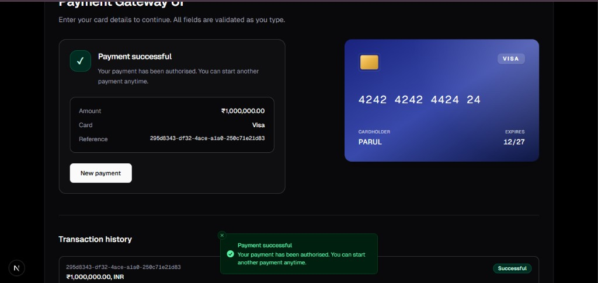
</p>

<p align="center"><strong>6 · Terminal success + ledger</strong> — Redux terminal panel with **reference UUID**, matching **history row**, and **toast reinforcement**—shows observability-minded feedback loops interviewers look for.</p>

<br />

<p align="center">
  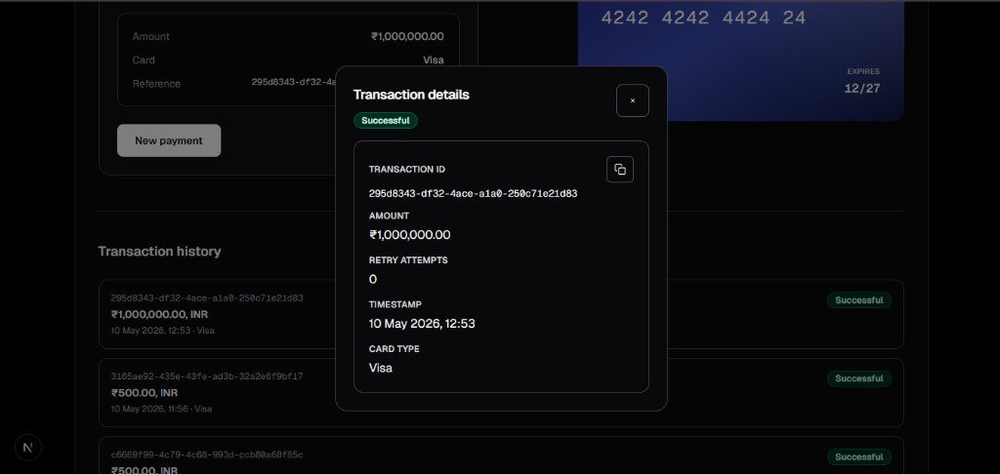
</p>

<p align="center"><strong>7 · Receipt-grade drill-down</strong> — Modal **`<dialog>`** with status badge, formatted INR amount, retry metadata, and **copy-to-clipboard**—accessible escape path + audit-friendly layout.</p>

<br />

<p align="center"><sub>Assets live in <a href="docs/screenshots/"><code>docs/screenshots/</code></a> · rename guide in <a href="docs/screenshots/README.md"><code>README.md</code></a> there.</sub></p>

</details>

<details>
<summary><strong>Expand — failure & timeout terminals, success toast, and mobile layouts</strong></summary>

<br />

<p align="center">
  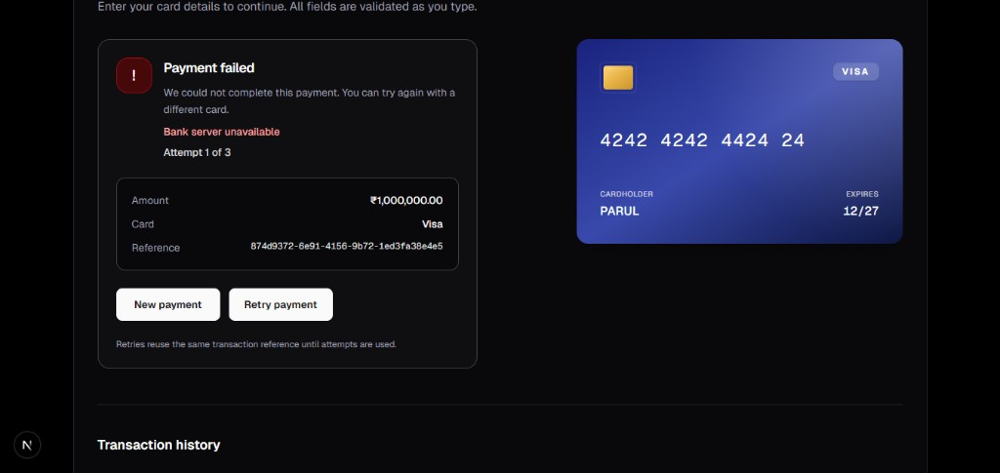
</p>

<p align="center"><strong>8 · Gateway failure</strong> — Distinct **failed** terminal with surfaced **`failureReason`**, **attempt budget**, stable **reference UUID**, and paired **Retry / New payment** controls.</p>

<br />

<p align="center">
  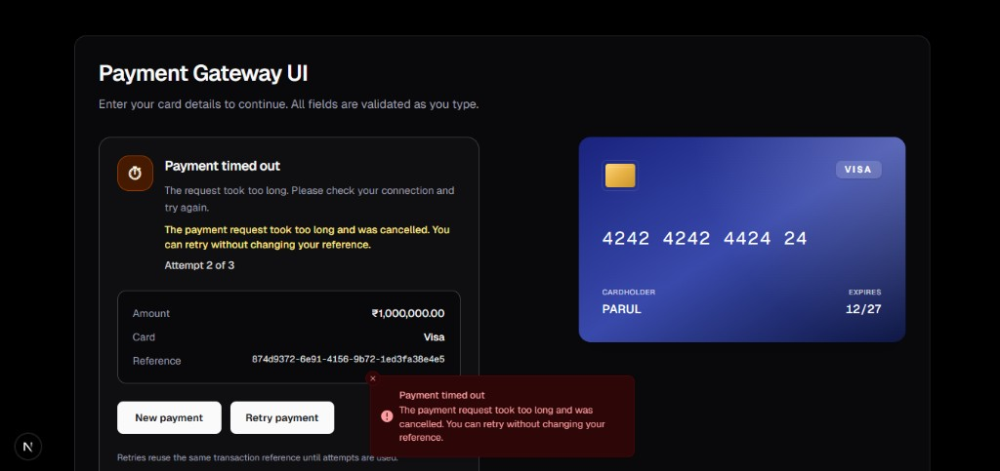
</p>

<p align="center"><strong>9 · Client-side timeout</strong> — **Timed-out** state after **`AbortController`** cancellation; duplicate messaging on-panel + **Sonner** illustrates resilient observability without losing the retry affordance.</p>

<br />

<p align="center">
  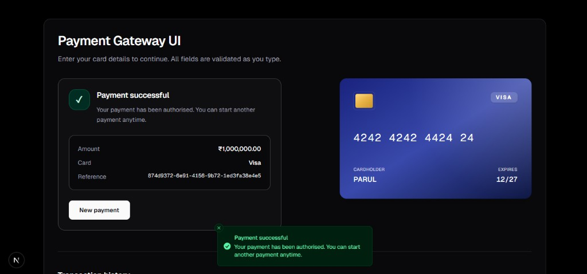
</p>

<p align="center"><strong>10 · Success + toast</strong> — Authorised path with **green toast reinforcement** alongside the terminal receipt—handy when recruiters skim for notification UX.</p>

<br />

<p align="center">
  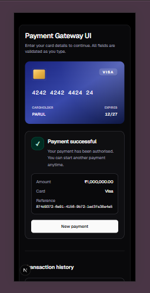
</p>

<p align="center"><strong>11 · Mobile success stack</strong> — **Preview-first** stacking on a narrow viewport: card chrome, terminal summary, and history teaser—shows responsive composition without a separate breakpoint screenshot collage.</p>

<br />

<p align="center">
  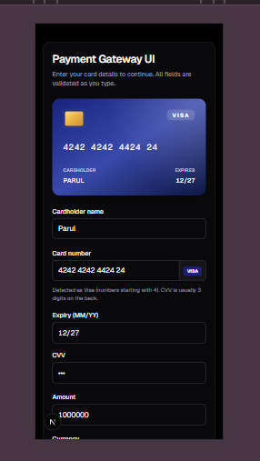
</p>

<p align="center"><strong>12 · Mobile checkout form</strong> — Touch-sized controls, **embedded Visa badge** in the PAN group, masked CVV, and INR-friendly amount entry—the real narrow-form counterpart to the desktop hero above.</p>

<br />

<p align="center"><sub>Same folder: <a href="docs/screenshots/"><code>docs/screenshots/</code></a> · files <code>08</code>–<code>12</code>.</sub></p>

</details>

---

## Folder structure

```
src/
├── app/                    # App Router routes, layout, providers, globals
│   ├── api/pay/            # Mock payment API (POST)
│   └── ...
├── components/
│   ├── card/               # Card preview & brand visuals
│   ├── payment/          # Form, status, layout, overlays
│   ├── transaction/      # History list, cards, details modal, badges
│   └── ui/                 # Shared primitives (Button, Badge, Spinner, …)
├── hooks/
│   ├── payment/          # usePayment, useRetry
│   └── transaction/      # Persistence subscription, history paging
├── services/payment/      # fetch orchestration, parsing, gateway simulation helpers
├── store/                  # Redux store, payment slice, selectors
├── utils/
│   ├── api/               # Route helpers (validation, delays, response shaping)
│   ├── formatters/        # Currency, card strings
│   ├── payment/           # Retry rules, timeouts, transaction drafts
│   ├── storage/           # localStorage + snapshot parsing
│   ├── transaction/       # Display/format helpers for history
│   ├── validation/        # Form-level validation
│   └── ...
├── constants/             # UI tokens, payment copy, API knobs, storage keys
└── types/                 # Shared TypeScript models (payment, API)
```

---

## Setup

```bash
git clone <your-repository-url>
cd Payment_Gateway   # or your repo folder name
npm install
npm run dev
```

Open **http://localhost:3000**.

Other scripts:

| Command | Purpose |
|---------|---------|
| `npm run lint` | ESLint |
| `npm run build` | Production build (`next build`) |
| `npm start` | Serve production build |

> **Note:** `next build` may require network access if fonts are fetched during build in your environment.

---

## Architecture decisions

1. **Redux Toolkit** — Single predictable store for payment status, errors, in-flight gateway flags, submission attempts, and transaction history. Selectors keep derived views (e.g. sorted history, “can retry”) out of components.
2. **Hooks + services + utils** — UI stays thin: **`usePayment`** coordinates submission; **`paymentService`** owns fetch + timeout outcomes; **utils** hold pure validation, formatting, and retry rules.
3. **App Router** — Server/client boundaries stay clear: mock API as **route handlers**, interactive checkout as **client components** under `Provider`.
4. **Centralized constants** — Copy, timing (`FRONTEND_TIMEOUT_MS`), retry caps, and **`LOCAL_STORAGE_KEYS`** avoid magic strings and keep UX/legal tone consistent.
5. **Idempotency** — Retrying with the **same** `transactionId` matches how real gateways expect client behavior and keeps history accurate under failures.

---

## Payment flow (step-by-step)

1. User completes the form; client validation gates submit.
2. On first submit, **`crypto.randomUUID()`** creates the transaction id (never regenerated on retry).
3. Redux enters **processing**; the UI disables the form and shows an overlay / live status region.
4. **`POST /api/pay`** runs with an **`AbortSignal`**; slow responses surface as a **timeout** outcome.
5. Outcomes map to terminal Redux state and **upsert** the corresponding row in history (including failures, so retries update one row).
6. If the outcome is retry-eligible and attempts remain, **Retry** reuses the same id and increments the submission attempt counter.
7. **`store.subscribe`** persists a normalized snapshot to **`localStorage`** when history or selection changes (writes skipped when serialized payload is unchanged).

```mermaid
flowchart LR
  subgraph Client
    A[Submit / Retry] --> B[usePayment]
    B --> C[paymentService]
    C --> D[/api/pay]
    D --> E[Redux upsert + status]
    E --> F[localStorage snapshot]
  end
```

---

## Accessibility

- **Keyboard**: Buttons for retry, new payment, history rows, and modal close; focus-visible rings on interactive elements.
- **Focus**: After terminal outcomes, focus moves to **Retry** when available; otherwise to the status heading. Opening transaction details moves focus to the close control and restores focus on dismiss.
- **ARIA / semantics**: Labels tied to controls (`htmlFor` / `id`), `aria-describedby` for hints and errors, `aria-live` regions where outcomes update, native **`<dialog>`** for details with explicit **`aria-modal`**.
- **Non-visual**: Screen reader text for processing announcements; badges rely on visible text (avoid redundant duplicated labels).

---

## Responsive design

- **Mobile-first** stacking (preview + form + history).
- **Tablet / desktop**: Two-column payment layout where space allows; history spans below with scroll-safe surfaces (`min-w-0`, controlled overflow).
- Typography and spacing scale conservatively between breakpoints.

---

## Error handling

| Scenario | UX |
|----------|-----|
| **Network** (`fetch` / `TypeError`) | Friendly “cannot reach service” style message; no raw stack traces. |
| **Client timeout** (`AbortError`) | Distinct copy explaining cancellation after waiting too long. |
| **API validation / HTTP errors** | Parsed bodies mapped to stable user-facing strings from constants. |
| **Gateway failure / gateway timeout** | Terminal statuses with reasons surfaced on the receipt row (`failureReason`) and status UI. |
| **Corrupt `localStorage`** | Snapshot parse/validation fails closed → empty history without crashing the app. |

---

## Assumptions

- **Mock gateway only** — No PSP keys, PCI vault, or 3-D Secure; `POST /api/pay` simulates latency and probabilistic outcomes for demos.
- **Front-end persistence** — History lives in **this browser** only; clearing site data resets it.
- **Simplified card model** — Brand detection is heuristic from PAN patterns; not a full BIN database.
- **Single-page checkout** — No shipping/billing address steps or saved payment methods UI.

---

## Future improvements

- **Automated tests**: unit tests for validators/retry math; integration tests for `/api/pay` and persistence hydration.
- **Observability**: client analytics + correlation ids for support.
- **Checkout expansion**: multi-step flow, saved instruments, regional methods.
- **Real PSP SDK**: tokenization + server-side intent confirmation.
- **Optimistic UI**: optional provisional rows with reconciliation against gateway responses.
- **Operational tooling**: admin replay / webhook simulator for integration QA.

---

## Deploying on Netlify

**Production is intended to run only on Netlify** (`netlify.toml` + `@netlify/plugin-nextjs`). This repo does **not** include Vercel configuration.

If Vercel is still connected to the same GitHub repository, every push can trigger a **second** deployment there (often failing while Netlify succeeds). To stop that entirely:

1. Open [Vercel Dashboard](https://vercel.com/dashboard) → select this site → **Settings** → **Git** → **Disconnect**, or delete the Vercel project.
2. Optional: on GitHub → repo **Settings** → **GitHub Apps** / **Installed GitHub Apps** → revoke or adjust **Vercel** if it still posts checks.

The Next.js app lives at the **repository root** (one `package.json`, one `package-lock.json`, one `netlify.toml`). The app uses **`@netlify/plugin-nextjs`** so App Router + **`/api/pay`** deploy correctly.

| Setting | Value |
|---------|--------|
| Build command | `npm run build` |
| **Publish directory** | **Leave empty** so **`@netlify/plugin-nextjs`** controls output. Do **not** set **`dist`**, **`out`**, or **`.next`** — that often yields Netlify’s generic **“Page not found”** even when the build logs look fine. |
| Base directory | **Leave empty** (build runs at repo root; matches `netlify.toml`). |
| Package directory | **Leave empty**. |
| Node | **20.x** — see **`.nvmrc`** and **`engines`** in `package.json` |

Smoke-test after deploy: **`/debug`**, then **`/deployment-check`**, then **`/`**. If **`/debug`** returns 404, fix Netlify build/publish settings — not the React tree.

After changing Netlify settings, trigger **Deploy site → Clear cache and deploy site**.

Portfolio screenshots live under **`docs/screenshots/`** and are wired in [**Visual showcase**](#visual-showcase) above.

---

## License

Private / portfolio use unless you attach another license.
